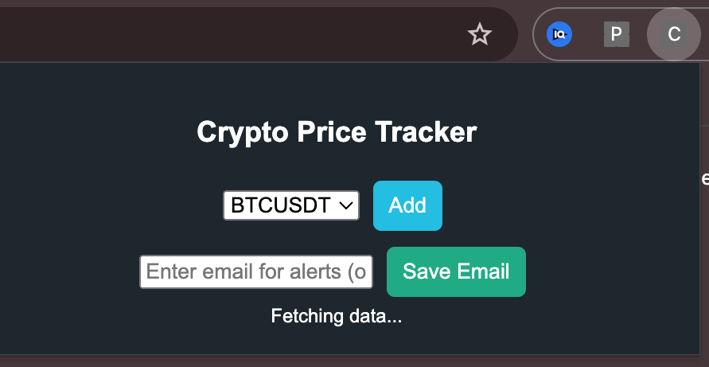
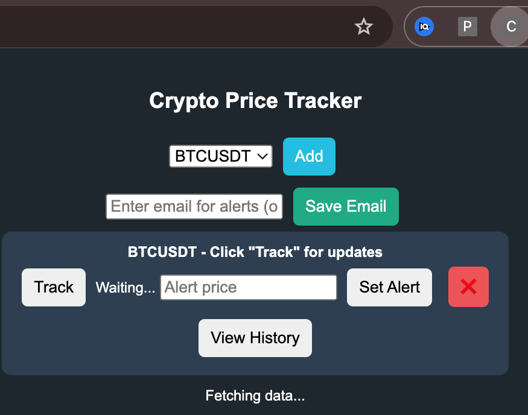
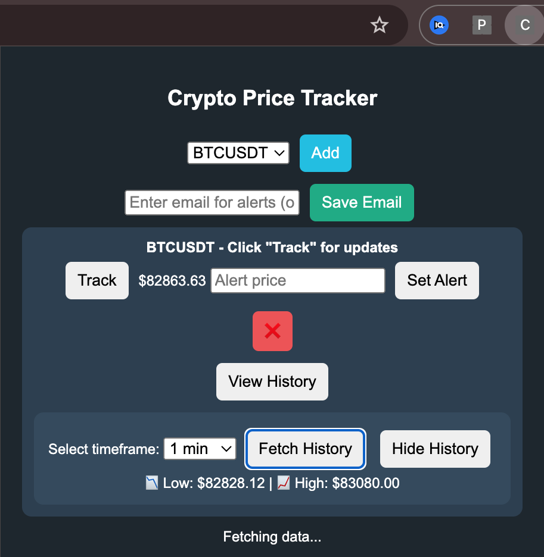

# 🚀 Crypto & Stock Price Tracker - Chrome Extension

Track real-time cryptocurrency prices, set alerts, and view historical data. This Chrome extension provides multi-currency support, email notifications, and an optimized UI for seamless tracking. 🔔📈

---

## Screenshots

<div align="center">
  
  
  
</div>

---

## 📌 Features

- **Real-time Price Tracking**: Fetches live cryptocurrency prices from the Binance API.
- **Multi-Currency Support**: Track multiple trading pairs using a dropdown menu (prevents invalid inputs).
- **Alerts & Notifications**: Set price alerts and receive notifications via browser alerts or email (if provided).
- **Historical Data View**: Toggle history view and select timeframes (1 min, 3 mins, 5 mins) to see the lowest/highest prices.
- **Toggleable History View**: The history data is only shown when the user chooses to view it.
- **Delete Tracked Pairs**: Remove unwanted currency pairs from your tracking list.
- **Persistent Storage**: Saves tracked pairs, alerts, and email settings using Chrome Storage.
- **Responsive & Modern UI**: Well-aligned, spacious, and professionally styled interface.

---

## 📥 Installation (For Users)

1. **Download the Latest Release**  
   Get the `.zip` file from this [Link](https://github.com/coderbenny/crypto-tracker-chrome-xtension/archive/refs/heads/main.zip).

2. **Unzip the Extension**  
   Extract the downloaded file to a convenient location.

3. **Load the Extension in Chrome**

   - Open `chrome://extensions/` in your Chrome browser.
   - Enable **Developer Mode** (toggle at the top-right).
   - Click **Load Unpacked** and select the extracted folder.

4. **Start Tracking!**  
   Click the extension icon and start monitoring cryptocurrency prices.

---

## 🛠️ Developer Guide

### Setting Up the Extension for Development

1. **Clone the Repository**
   ```bash
   git clone https://github.com/your-repo-link.git
   cd crypto-price-tracker-extension
   ```
